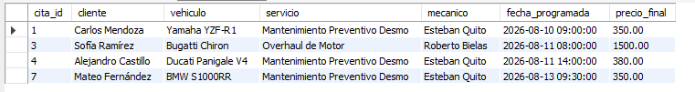
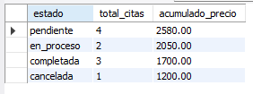
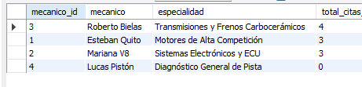
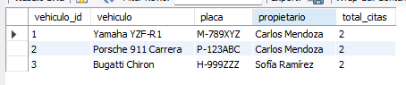
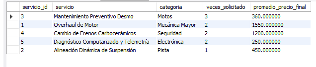

## consulta 1
 1. Listado de citas pendientes ordenadas por fecha más cercana
 

## consulta 2
 2. Total estimado por estado de cita

## consulta 3
3. Ranking de mecánicos por cantidad de citas atendidas

## consulta 4
4. Vehículos con más de una cita registrada

## consulta 5
5. Servicios más solicitados y promedio de precio final

